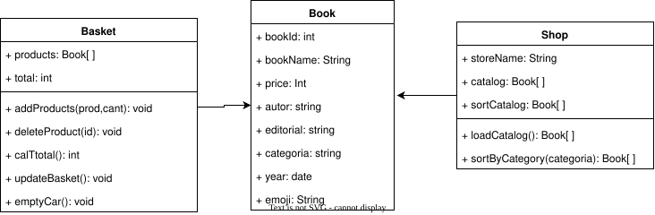

# 📚 Proyecto: Librería Virtual - Hackathon Front 1

## 👥 Integrantes y Roles
[cite_start]Según la estructura de equipo sugerida[cite: 10], nuestro equipo se divide en:
* **Product Owner:** Andrés Felipe Orozco Loaiza
* **FullStack:** John Fader Arrubla
* **FrontEnd:** Daniela Vallejo Jojoa
* **FrontEnd:** Cristian Alvarez

## 🎯 Objetivo del Proyecto
[cite_start]Desarrollar una tienda virtual interactiva utilizando **HTML, CSS y JavaScript puro**, aplicando **Programación Orientada a Objetos (POO)** y manipulación del DOM en tiempo real[cite: 12].

## 🛠️ Diseño del Sistema (UML)
[cite_start]Para asegurar un código organizado y evitar lógica desordenada, hemos diseñado el siguiente plano de clases:

## Maqueta

---------------------------------------------------
|                    HEADER                        |
| Logo | Nombre Tienda | Buscador | Carrito 🛒    |
---------------------------------------------------

---------------------------------------------------
|                   FILTROS                        |
| [Todos] [Clasicos] [Novela] [Fantasía] [Distopía]|
---------------------------------------------------

--------------------------------------------------------
---------------------------------------------------------
|                 CONTENIDO PRINCIPAL                   |
|-------------------------------------------------------|
|                                                       |
|      CATÁLOGO DE LIBROS        |   CARRITO           |
|                                |                      |
|  [CARD] [CARD] [CARD]          |  Productos           |
|  [CARD] [CARD] [CARD]          |  Total               |
|                                |  Vaciar carrito      |
|                                |                      | 
|                                                 |
---------------------------------------------------

---------------------------------------------------
|                     FOOTER                       |

| Derechos reservados | Redes sociales            |
---------------------------------------------------

           CARD
--------------------------
|        IMAGEN          |
| Categoría              |
| Título                 |
| Autor                  |
| Editorial - Año        |
| Precio                 |
| [Agregar 🛒]           |
--------------------------

URL: https://www.figma.com/make/zKFlbJVmn7tiizwUmikob2/Untitled?p=f&t=wDBcDLJhXO2ZPEAk-0
